# Deep Heating RxJS Data Flow

This document explains how data flows through the reactive streams in the deep-heating-rx package.

## Architecture Overview

The system implements a **reactive feedback control system** where:

1. External data (Home Assistant entities, user commands) flows in
2. Data is aggregated and transformed through multiple layers
3. Control decisions are made at room and TRV level
4. Actions are applied and fed back into the system

## High-Level Data Flow

```mermaid
flowchart LR
    subgraph Input["Input"]
        HA[("Home Assistant")]
        User[("User Commands")]
        Timers["Timers"]
    end

    subgraph Processing["Processing Pipeline"]
        L1["Raw Data<br/>Extraction"]
        L2["Device &<br/>Room Config"]
        L3["Device<br/>State"]
        L4["Room<br/>Aggregation"]
        L5["Scheduling<br/>& Mode"]
        L6["Target<br/>Calculation"]
        L7["Decision<br/>Points"]
        L8["Action<br/>Generation"]
    end

    subgraph Output["Output"]
        HAOut[("Home Assistant<br/>Climate Control")]
    end

    Input --> L1
    L1 --> L2
    L2 --> L3
    L3 --> L4
    L4 --> L5
    L5 --> L6
    L6 --> L7
    L7 --> L8
    L8 --> HAOut
    L8 -.->|"Feedback"| L3

    classDef input fill:#99ff99,stroke:#00cc00
    classDef output fill:#ffcc99,stroke:#cc6600
    classDef process fill:#e6e6e6,stroke:#666666

    class HA,User,Timers input
    class HAOut output
    class L1,L2,L3,L4,L5,L6,L7,L8 process
```

## Detailed Diagrams

For detailed views of each section, see:

- [Input Processing](./docs/data-flow-input.md) - External sources to device state (Layers 1-4)
- [Room Aggregation](./docs/data-flow-rooms.md) - Device state to room targets (Layers 5-8)
- [Decision & Actions](./docs/data-flow-decisions.md) - Room targets to TRV actions (Layers 9-14)
- [Output & Feedback](./docs/data-flow-output.md) - Actions to Home Assistant with feedback loops (Layers 15-16)

## Key Concepts

### Feedback Loops

The system has two main feedback loops:

1. **TRV Control Loop**: When TRV actions are applied, the new state feeds back into `trvControlStateSubject`, which triggers recalculation of decisions.

2. **Heating Control Loop**: When the main heating is turned on/off, the new state feeds back to inform future heating decisions.

### Timing Intervals

| Timer              | Interval | Purpose                                |
| ------------------ | -------- | -------------------------------------- |
| House Mode         | 63s      | Re-evaluate house mode (auto/sleeping) |
| Room Schedule      | 60s      | Check for schedule changes             |
| Target Temperature | 60s      | Recalculate desired temperatures       |

### Caching Strategy

The system uses `shareReplayLatestDistinctByKey` extensively:

- Prevents subscribers from receiving unchanged data
- Allows new subscribers to get the latest value immediately
- Groups state by TRV ID or Room name for efficient lookups
