# Deep Heating RxJS Data Flow

This diagram shows how data flows through the reactive streams in the deep-heating-rx package.

## Architecture Overview

The system implements a **reactive feedback control system** where:

1. External data (Home Assistant entities, user commands) flows in
2. Data is aggregated and transformed through multiple layers
3. Control decisions are made at room and TRV level
4. Actions are applied and fed back into the system

## Data Flow Diagram

```mermaid
flowchart TB
    subgraph External["External Data Sources"]
        HA[("Home Assistant<br/>Entity Updates")]
        UserCmd[("User Commands<br/>Room Adjustments")]
        Timer60["⏱️ Timer 60s"]
        Timer63["⏱️ Timer 63s"]
    end

    subgraph Layer1["Layer 1: Raw Data Extraction"]
        TempSensor["temperatureSensorUpdate$<br/><i>TemperatureSensorEntity</i>"]
        TrvApiUpdates["trvApiUpdates$<br/><i>TrvUpdate</i>"]
        HeatingApiUpdates["heatingApiUpdates$<br/><i>HeatingUpdate</i>"]
        ButtonEvents["buttonEvents$<br/><i>GoodnightEventEntity</i>"]
    end

    subgraph Layer2["Layer 2: Room & TRV Configuration"]
        Rooms["rooms$<br/><i>Room definitions</i>"]
        RoomSensors["roomSensors$<br/><i>Room → Sensor IDs</i>"]
        RoomTrvs["roomTrvs$<br/><i>Room → TRV IDs</i>"]
    end

    subgraph Layer3["Layer 3: Device State"]
        TrvTemps["trvTemperatures$<br/><i>TRV temp readings</i>"]
        TrvSchedules["trvHiveHeatingSchedules$<br/><i>Week schedules</i>"]
        TrvControlSubject[["trvControlStateSubject"]]
        TrvStatusSubject[["trvStatusSubject"]]
        HeatingStatusSubject[["heatingStatusSubject"]]
    end

    subgraph Layer4["Layer 4: Control State Derivation"]
        TrvControlStates["trvControlStates$<br/><i>Grouped by TRV ID</i>"]
        TrvModes["trvModes$<br/><i>heat/off</i>"]
        TrvTargetTemps["trvTargetTemperatures$<br/><i>Current targets</i>"]
    end

    subgraph Layer5["Layer 5: Room Aggregation"]
        RoomTemps["roomTemperatures$<br/><i>Sensor readings</i>"]
        RoomTrvModes["roomTrvModes$<br/><i>All TRV modes</i>"]
        RoomTrvTemps["roomTrvTemperatures$<br/><i>All TRV temps</i>"]
        RoomTrvTargets["roomTrvTargetTemperatures$<br/><i>All TRV targets</i>"]
        TrvStatuses["trvStatuses$<br/><i>Heating status</i>"]
        RoomTrvStatuses["roomTrvStatuses$<br/><i>Room heating</i>"]
        RoomStatuses["roomStatuses$<br/><i>Is room heating?</i>"]
    end

    subgraph Layer6["Layer 6: House Mode & Scheduling"]
        HouseModes["houseModes$<br/><i>Auto/Sleeping</i>"]
        RoomHiveSchedules["roomHiveHeatingSchedules$<br/><i>Room schedules</i>"]
        RoomSchedules["roomSchedules$<br/><i>Current schedule</i>"]
        RoomSchedTargets["roomScheduledTargetTemperatures$<br/><i>Scheduled target</i>"]
        TrvSchedTargets["trvScheduledTargetTemperatures$<br/><i>TRV scheduled target</i>"]
    end

    subgraph Layer7["Layer 7: User Adjustments & Room Mode"]
        RoomAdjustments["roomAdjustments$<br/><i>+/- temperature</i>"]
        RoomModes["roomModes$<br/><i>Off/Auto/Sleeping</i>"]
    end

    subgraph Layer8["Layer 8: Room Targets"]
        RoomTargets["roomTargetTemperatures$<br/><i>Desired room temp</i>"]
    end

    subgraph Layer9["Layer 9: Decision Points"]
        RoomDecisions["roomDecisionPoints$<br/><i>Room analysis</i>"]
    end

    subgraph Layer10["Layer 10: TRV Decision Points"]
        TrvDecisions["trvDecisionPoints$<br/><i>Per-TRV analysis</i>"]
    end

    subgraph Layer11["Layer 11: TRV Target Calculation"]
        TrvDesiredTargets["trvDesiredTargetTemperatures$<br/><i>Calculated optimal</i>"]
    end

    subgraph Layer12["Layer 12: TRV Actions"]
        TrvActions["trvActions$<br/><i>Mode/target changes</i>"]
    end

    subgraph Layer13["Layer 13: Synthesized Status"]
        TrvSynthStatus["trvSynthesisedStatuses$<br/><i>Is TRV heating?</i>"]
    end

    subgraph Layer14["Layer 14: Action Application"]
        AppliedTrvActions["appliedTrvActions$<br/><i>Applied changes</i>"]
    end

    subgraph Layer15["Layer 15: Heating Aggregation"]
        TrvsHeating["trvsHeating$<br/><i>Set of heating TRVs</i>"]
        TrvsAnyHeating["trvsAnyHeating$<br/><i>Boolean</i>"]
        RoomsHeating["roomsHeating$<br/><i>Set of heating rooms</i>"]
        RoomsAnyHeating["roomsAnyHeating$<br/><i>Boolean</i>"]
    end

    subgraph Layer16["Layer 16: Main Heating Control"]
        HeatingActions["heatingActions$<br/><i>On/Off</i>"]
        AppliedHeatingActions["appliedHeatingActions$<br/><i>Applied</i>"]
    end

    subgraph Output["Outputs to Home Assistant"]
        HAClimate[("Home Assistant<br/>Climate Entities")]
        HAHeating[("Home Assistant<br/>Heating System")]
    end

    %% Layer 1 connections
    HA --> TempSensor
    HA --> TrvApiUpdates
    HA --> HeatingApiUpdates
    HA --> ButtonEvents

    %% Layer 2 connections
    Rooms --> RoomSensors
    Rooms --> RoomTrvs

    %% Layer 3 connections
    TrvApiUpdates --> TrvTemps
    TrvApiUpdates --> TrvSchedules
    TrvApiUpdates --> TrvControlSubject
    TrvApiUpdates --> TrvStatusSubject
    HeatingApiUpdates --> HeatingStatusSubject

    %% Layer 4 connections
    TrvControlSubject --> TrvControlStates
    TrvControlStates --> TrvModes
    TrvControlStates --> TrvTargetTemps

    %% Layer 5 connections
    RoomSensors --> RoomTemps
    TempSensor --> RoomTemps
    RoomTrvs --> RoomTrvModes
    TrvModes --> RoomTrvModes
    RoomTrvs --> RoomTrvTemps
    TrvTemps --> RoomTrvTemps
    RoomTrvs --> RoomTrvTargets
    TrvTargetTemps --> RoomTrvTargets
    TrvStatusSubject --> TrvStatuses
    RoomTrvs --> RoomTrvStatuses
    TrvStatuses --> RoomTrvStatuses
    RoomTrvStatuses --> RoomStatuses

    %% Layer 6 connections
    ButtonEvents --> HouseModes
    Timer63 --> HouseModes
    RoomTrvs --> RoomHiveSchedules
    TrvSchedules --> RoomHiveSchedules
    Rooms --> RoomSchedules
    RoomHiveSchedules --> RoomSchedules
    Timer60 --> RoomSchedules
    Rooms --> RoomSchedTargets
    RoomSchedules --> RoomSchedTargets
    Timer60 --> RoomSchedTargets
    TrvSchedules --> TrvSchedTargets

    %% Layer 7 connections
    UserCmd --> RoomAdjustments
    Rooms --> RoomAdjustments
    Rooms --> RoomModes
    HouseModes --> RoomModes
    RoomTrvModes --> RoomModes

    %% Layer 8 connections
    Rooms --> RoomTargets
    RoomModes --> RoomTargets
    RoomSchedTargets --> RoomTargets
    RoomAdjustments --> RoomTargets

    %% Layer 9 connections
    Rooms --> RoomDecisions
    RoomTargets --> RoomDecisions
    RoomTemps --> RoomDecisions
    RoomTrvTargets --> RoomDecisions
    RoomTrvTemps --> RoomDecisions
    RoomTrvModes --> RoomDecisions

    %% Layer 10 connections
    RoomDecisions --> TrvDecisions

    %% Layer 11 connections
    TrvDecisions --> TrvDesiredTargets
    Timer60 --> TrvDesiredTargets

    %% Layer 12 connections
    TrvDesiredTargets --> TrvActions
    TrvControlStates --> TrvActions
    TrvTemps --> TrvActions
    TrvSchedTargets --> TrvActions

    %% Layer 13 connections
    TrvTemps --> TrvSynthStatus
    TrvControlStates --> TrvSynthStatus

    %% Layer 14 connections
    TrvActions --> AppliedTrvActions
    TrvControlStates --> AppliedTrvActions
    TrvSchedTargets --> AppliedTrvActions

    %% Feedback loops
    AppliedTrvActions --> TrvControlSubject
    TrvSynthStatus --> TrvStatusSubject
    AppliedTrvActions --> HAClimate

    %% Layer 15 connections
    TrvStatuses --> TrvsHeating
    TrvsHeating --> TrvsAnyHeating
    RoomDecisions --> RoomsHeating
    RoomsHeating --> RoomsAnyHeating

    %% Layer 16 connections
    RoomsAnyHeating --> HeatingActions
    HeatingStatusSubject --> HeatingActions
    HeatingActions --> AppliedHeatingActions
    AppliedHeatingActions --> HeatingStatusSubject
    AppliedHeatingActions --> HAHeating

    %% Styling
    classDef subject fill:#ff9999,stroke:#cc0000
    classDef timer fill:#99ccff,stroke:#0066cc
    classDef external fill:#99ff99,stroke:#00cc00
    classDef output fill:#ffcc99,stroke:#cc6600

    class TrvControlSubject,TrvStatusSubject,HeatingStatusSubject subject
    class Timer60,Timer63 timer
    class HA,UserCmd external
    class HAClimate,HAHeating output
```



## Legend

| Color             | Meaning                                                      |
| ----------------- | ------------------------------------------------------------ |
| 🔴 Red (Subjects) | Feedback loop points where actions flow back into the system |
| 🔵 Blue (Timers)  | Periodic refreshes that trigger recalculation                |
| 🟢 Green          | External data sources                                        |
| 🟠 Orange         | Outputs to Home Assistant                                    |

## Key Feedback Loops

### TRV Control Loop

```
appliedTrvActions$ → trvControlStateSubject → trvControlStates$
  → trvModes$/trvTargetTemperatures$ → roomTrvModes$/roomTrvTargetTemperatures$
  → roomDecisionPoints$ → trvDecisionPoints$ → trvDesiredTargetTemperatures$
  → trvActions$ → appliedTrvActions$ (cycle continues)
```

### Main Heating Control Loop

```
appliedHeatingActions$ → heatingStatusSubject → heatingStatuses$
  → heatingActions$ → appliedHeatingActions$ (cycle continues)
```

## Timing Intervals

- **House Mode refresh**: 63 seconds
- **Room Schedule refresh**: 60 seconds
- **Room Scheduled Target Temperature refresh**: 60 seconds
- **TRV Desired Target Temperature refresh**: 60 seconds

These timers ensure scheduled changes are evaluated regularly even if no entity updates occur.

## Key Caching Strategy

The system uses `shareReplayLatestDistinctByKey` extensively for:

- Per-TRV state (modes, temperatures, decisions)
- Per-room state (temperatures, targets, decisions)

This prevents subscribers from receiving unchanged data and allows new subscribers to get the latest value immediately.
