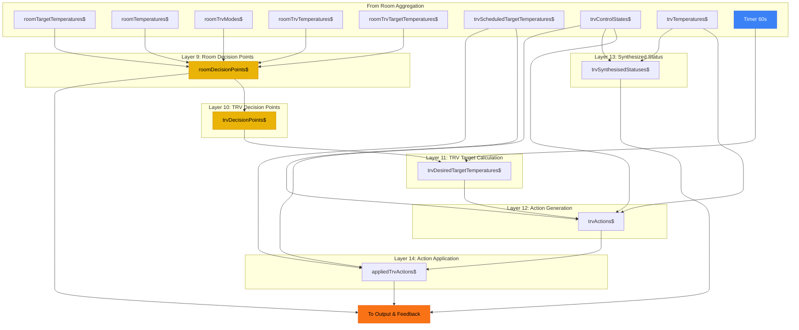

# Decision & Action Processing (Layers 9-14)

[Back to Overview](../DATA-FLOW.md)

This diagram shows the decision-making process that determines what actions to take on TRVs.

## Data Flow



## Stream Descriptions

### Layer 9: Room Decision Points

Analyzes each room to determine if heating is needed:

| Stream                | Type                                        | Description                                                            |
| --------------------- | ------------------------------------------- | ---------------------------------------------------------------------- |
| `roomDecisionPoints$` | `GroupedObservable<RoomName, RoomDecision>` | Contains: current temp, target temp, all TRV states, heating required? |

**Decision Logic:**

```
Room needs heating when:
  - Current temperature < Target temperature - hysteresis
  - AND at least one TRV is available for heating
```

### Layer 10: TRV Decision Points

Breaks down room decisions to per-TRV decisions:

| Stream               | Type                                    | Description                           |
| -------------------- | --------------------------------------- | ------------------------------------- |
| `trvDecisionPoints$` | `GroupedObservable<TrvId, TrvDecision>` | Per-TRV heating decision with context |

### Layer 11: TRV Target Calculation

Calculates optimal target temperature for each TRV:

| Stream                          | Type                               | Description                     |
| ------------------------------- | ---------------------------------- | ------------------------------- |
| `trvDesiredTargetTemperatures$` | `GroupedObservable<TrvId, number>` | What target the TRV should have |

**Calculation Logic:**

```
If room needs heating:
  - Set TRV target high enough to trigger heating
  - Account for TRV's own temperature reading vs room sensor

If room is at target:
  - Set TRV target to maintain temperature
```

### Layer 12: Action Generation

Determines what changes need to be made:

| Stream        | Type                                  | Description                             |
| ------------- | ------------------------------------- | --------------------------------------- |
| `trvActions$` | `GroupedObservable<TrvId, TrvAction>` | Mode change and/or target change needed |

**Action Types:**

- `SetMode(heat | off)` - Turn TRV on or off
- `SetTarget(temperature)` - Change target temperature
- `NoAction` - TRV already in correct state

### Layer 13: Synthesized Status

Determines heating status based on known state:

| Stream                    | Type                                | Description                   |
| ------------------------- | ----------------------------------- | ----------------------------- |
| `trvSynthesisedStatuses$` | `GroupedObservable<TrvId, boolean>` | Is this TRV actively heating? |

### Layer 14: Action Application

Applies actions and handles side effects:

| Stream               | Type                                      | Description                    |
| -------------------- | ----------------------------------------- | ------------------------------ |
| `appliedTrvActions$` | `GroupedObservable<TrvId, AppliedAction>` | Actions sent to Home Assistant |

## Hysteresis

To prevent rapid on/off cycling:

- Heat ON when: `currentTemp < targetTemp - 0.5°C`
- Heat OFF when: `currentTemp >= targetTemp`

## Key Files

- `src/lib/streams/rooms/roomDecisionPoints.ts` - Room analysis
- `src/lib/streams/trvs/trvDecisionPoints.ts` - TRV analysis
- `src/lib/streams/trvs/trvDesiredTargetTemperatures.ts` - Target calculation
- `src/lib/streams/trvs/trvActions.ts` - Action generation
