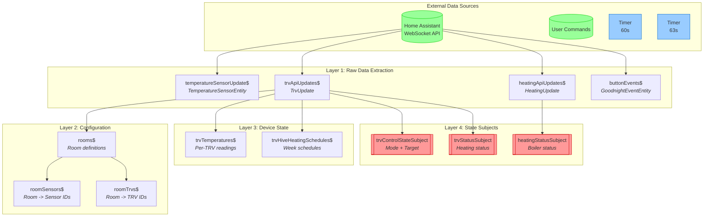

# Input Processing (Layers 1-4)

[Back to Overview](../DATA-FLOW.md)

This diagram shows how external data enters the system and is extracted into typed streams.

## Data Flow

## Stream Descriptions

### Layer 1: Raw Data Extraction

| Stream                     | Type                      | Description                                |
| -------------------------- | ------------------------- | ------------------------------------------ |
| `temperatureSensorUpdate$` | `TemperatureSensorEntity` | Temperature readings from external sensors |
| `trvApiUpdates$`           | `TrvUpdate`               | All TRV state changes from Home Assistant  |
| `heatingApiUpdates$`       | `HeatingUpdate`           | Main heating system state                  |
| `buttonEvents$`            | `GoodnightEventEntity`    | Goodnight button press events              |

### Layer 2: Configuration

| Stream         | Type                        | Description                             |
| -------------- | --------------------------- | --------------------------------------- |
| `rooms$`       | `Room[]`                    | Static room configuration               |
| `roomSensors$` | `Map<RoomName, SensorId[]>` | Maps rooms to their temperature sensors |
| `roomTrvs$`    | `Map<RoomName, TrvId[]>`    | Maps rooms to their TRVs                |

### Layer 3: Device State

| Stream                     | Type                                     | Description                         |
| -------------------------- | ---------------------------------------- | ----------------------------------- |
| `trvTemperatures$`         | `GroupedObservable<TrvId, number>`       | Current temperature reading per TRV |
| `trvHiveHeatingSchedules$` | `GroupedObservable<TrvId, WeekSchedule>` | Heating schedule per TRV            |

### Layer 4: State Subjects (Feedback Points)

These are `BehaviorSubject` instances that allow feedback loops:

| Subject                  | Type              | Description                                    |
| ------------------------ | ----------------- | ---------------------------------------------- |
| `trvControlStateSubject` | `TrvControlState` | Current mode (heat/off) and target temperature |
| `trvStatusSubject`       | `TrvStatus`       | Whether TRV is actively heating                |
| `heatingStatusSubject`   | `HeatingStatus`   | Whether main boiler is on                      |

## Key Files

- `src/lib/streams/homeAssistant/` - Layer 1 extractors
- `src/lib/streams/rooms.ts` - Layer 2 configuration
- `src/lib/streams/trvs/` - Layer 3 & 4 TRV state
