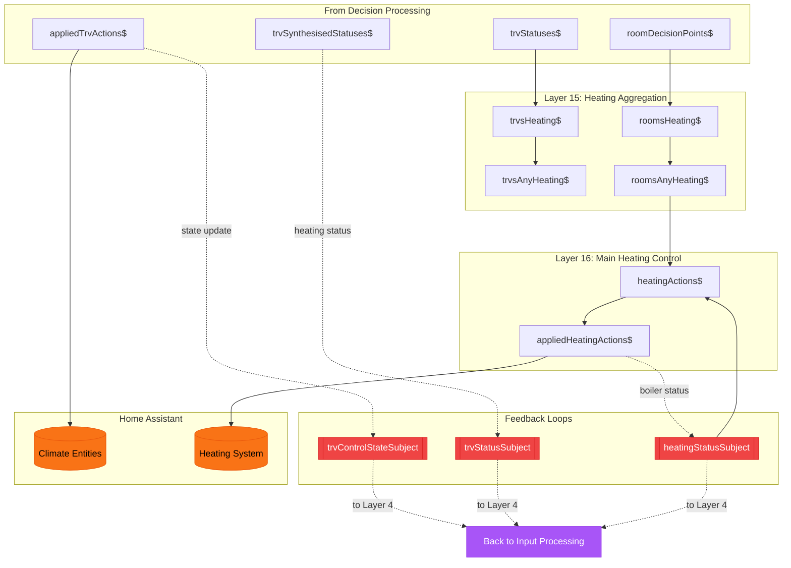

# Output & Feedback (Layers 15-16)

[Back to Overview](../DATA-FLOW.md)

This diagram shows how actions are sent to Home Assistant and how state feeds back into the system.

## Data Flow



## Stream Descriptions

### Layer 15: Heating Aggregation

Aggregates heating state across all TRVs and rooms:

| Stream             | Type            | Description                               |
| ------------------ | --------------- | ----------------------------------------- |
| `trvsHeating$`     | `Set<TrvId>`    | Set of TRV IDs that are currently heating |
| `trvsAnyHeating$`  | `boolean`       | True if any TRV is heating                |
| `roomsHeating$`    | `Set<RoomName>` | Set of room names that need heating       |
| `roomsAnyHeating$` | `boolean`       | True if any room needs heating            |

### Layer 16: Main Heating Control

Controls the main boiler/heating system:

| Stream                   | Type                   | Description                     |
| ------------------------ | ---------------------- | ------------------------------- |
| `heatingActions$`        | `HeatingAction`        | On/Off command for main heating |
| `appliedHeatingActions$` | `AppliedHeatingAction` | Confirmed action sent to HA     |

**Boiler Control Logic:**

```
Turn ON when:
  - Any room needs heating
  - AND boiler is currently off

Turn OFF when:
  - No rooms need heating
  - AND boiler is currently on
```

## Feedback Loops Explained

### TRV Control Feedback

```
appliedTrvActions$
    → trvControlStateSubject
    → trvControlStates$
    → [used in decision making]
```

When a TRV action is applied:

1. The new state (mode + target) is pushed to `trvControlStateSubject`
2. This updates `trvControlStates$`
3. Which feeds into decision points
4. Allowing the system to know the TRV's current state

### TRV Status Feedback

```
trvSynthesisedStatuses$
    → trvStatusSubject
    → trvStatuses$
    → [used in heating aggregation]
```

The synthesized status (whether TRV is actively heating) feeds back to inform heating aggregation.

### Main Heating Feedback

```
appliedHeatingActions$
    → heatingStatusSubject
    → [used in heatingActions$]
```

The boiler's current state feeds back to prevent unnecessary on/off commands.

## Why Feedback Matters

Without feedback loops:

- System wouldn't know if actions were applied
- Would keep sending the same commands
- Couldn't react to actual state changes

With feedback loops:

- System tracks current state
- Only sends commands when state change is needed
- Can respond to external changes (manual TRV adjustments)

## Key Files

- `src/lib/streams/heating/` - Main heating control
- `src/lib/streams/trvs/appliedTrvActions.ts` - TRV action application
- `src/lib/streams/DeepHeating.ts` - Feedback loop wiring
