# Room Aggregation (Layers 5-8)

[Back to Overview](../DATA-FLOW.md)

This diagram shows how device-level state is aggregated to room-level and combined with scheduling to produce target temperatures.

## Data Flow

```mermaid
flowchart TB
    subgraph Inputs["From Input Processing"]
        TrvControl["trvControlStates$"]
        TrvTemps["trvTemperatures$"]
        TrvSchedules["trvHiveHeatingSchedules$"]
        TempSensor["temperatureSensorUpdate$"]
        RoomTrvs["roomTrvs$"]
        RoomSensors["roomSensors$"]
        ButtonEvents["buttonEvents$"]
        UserCmd[("User Commands")]
        Timer60["Timer 60s"]
        Timer63["Timer 63s"]
    end

    subgraph Layer5["Layer 5: Room Aggregation"]
        RoomTemps["roomTemperatures$"]
        RoomTrvModes["roomTrvModes$"]
        RoomTrvTemps["roomTrvTemperatures$"]
        RoomTrvTargets["roomTrvTargetTemperatures$"]
    end

    subgraph Layer6["Layer 6: Scheduling & House Mode"]
        HouseModes["houseModes$"]
        RoomSchedules["roomSchedules$"]
        RoomSchedTargets["roomScheduledTargetTemperatures$"]
        TrvSchedTargets["trvScheduledTargetTemperatures$"]
    end

    subgraph Layer7["Layer 7: User Adjustments"]
        RoomAdjustments["roomAdjustments$"]
        RoomModes["roomModes$"]
    end

    subgraph Layer8["Layer 8: Target Calculation"]
        RoomTargets["roomTargetTemperatures$"]
    end

    %% Layer 5 connections
    RoomSensors --> RoomTemps
    TempSensor --> RoomTemps
    RoomTrvs --> RoomTrvModes
    TrvControl --> RoomTrvModes
    RoomTrvs --> RoomTrvTemps
    TrvTemps --> RoomTrvTemps
    RoomTrvs --> RoomTrvTargets
    TrvControl --> RoomTrvTargets

    %% Layer 6 connections
    ButtonEvents --> HouseModes
    Timer63 --> HouseModes
    TrvSchedules --> RoomSchedules
    Timer60 --> RoomSchedules
    RoomSchedules --> RoomSchedTargets
    Timer60 --> RoomSchedTargets
    TrvSchedules --> TrvSchedTargets

    %% Layer 7 connections
    UserCmd --> RoomAdjustments
    HouseModes --> RoomModes
    RoomTrvModes --> RoomModes

    %% Layer 8 connections
    RoomModes --> RoomTargets
    RoomSchedTargets --> RoomTargets
    RoomAdjustments --> RoomTargets

    %% Output
    RoomTargets --> Output["To Decision Processing"]
    RoomTemps --> Output
    RoomTrvModes --> Output
    RoomTrvTemps --> Output
    RoomTrvTargets --> Output
    TrvSchedTargets --> Output

    %% Styling
    classDef timer fill:#99ccff,stroke:#0066cc
    classDef user fill:#99ff99,stroke:#00cc00
    classDef output fill:#ffcc99,stroke:#cc6600

    class Timer60,Timer63 timer
    class UserCmd user
    class Output output
```



## Stream Descriptions

### Layer 5: Room Aggregation

Combines device-level data into room-level views:

| Stream                       | Type                                     | Description                                     |
| ---------------------------- | ---------------------------------------- | ----------------------------------------------- |
| `roomTemperatures$`          | `GroupedObservable<RoomName, number>`    | Temperature from external sensor for each room  |
| `roomTrvModes$`              | `GroupedObservable<RoomName, TrvMode[]>` | Current mode of all TRVs in each room           |
| `roomTrvTemperatures$`       | `GroupedObservable<RoomName, number[]>`  | Temperature readings from all TRVs in each room |
| `roomTrvTargetTemperatures$` | `GroupedObservable<RoomName, number[]>`  | Target temperatures of all TRVs in each room    |

### Layer 6: Scheduling & House Mode

Determines what temperature should be based on time and mode:

| Stream                             | Type                                    | Description                                 |
| ---------------------------------- | --------------------------------------- | ------------------------------------------- |
| `houseModes$`                      | `HouseMode`                             | Current house mode (Auto, Sleeping)         |
| `roomSchedules$`                   | `GroupedObservable<RoomName, Schedule>` | Active schedule for each room               |
| `roomScheduledTargetTemperatures$` | `GroupedObservable<RoomName, number>`   | What the schedule says the target should be |
| `trvScheduledTargetTemperatures$`  | `GroupedObservable<TrvId, number>`      | Scheduled target per TRV                    |

### Layer 7: User Adjustments

Handles manual overrides:

| Stream             | Type                                    | Description                             |
| ------------------ | --------------------------------------- | --------------------------------------- |
| `roomAdjustments$` | `GroupedObservable<RoomName, number>`   | User's +/- adjustment to scheduled temp |
| `roomModes$`       | `GroupedObservable<RoomName, RoomMode>` | Room-level mode (Off, Auto, Sleeping)   |

### Layer 8: Target Calculation

Produces the final desired temperature:

| Stream                    | Type                                  | Description                           |
| ------------------------- | ------------------------------------- | ------------------------------------- |
| `roomTargetTemperatures$` | `GroupedObservable<RoomName, number>` | Final target = scheduled + adjustment |

## House Mode Logic

```
Auto Mode:
  - Uses scheduled temperatures
  - Allows user adjustments

Sleeping Mode:
  - Triggered by Goodnight button
  - Reduces temperatures to sleeping levels
  - Auto-reverts after 63 seconds of no activity
```

## Key Files

- `src/lib/streams/rooms/` - Room aggregation streams
- `src/lib/streams/houseModes.ts` - House mode logic
- `src/lib/streams/schedules/` - Scheduling logic
